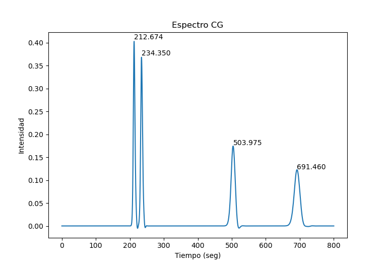

# plot-gas-cromatography
Parses GC (tabbed or csv) data and plots the spectra with annotated peaks  
The parameter "N" indicates how many values to the side will use to check if the value is a maximum.  
It does shrink the data (just for the search) in that number at the start and at the end so if you have peaks near edges be careful.  

I know there are libraries that do this and much better, I wanted to try if I could do it. So it is pretty rudimentary.  

If you setup the batch file in your Windows PATH you can run the program in the Windows Run (Win+R) just by passing:  
`plot_cg filepath filetype title(opt) N(opt)`  

You can install matplotlib by installing the requirements with `pip`:  
`python -m pip install matplotlib`  
or  
`python -m pip install -r requirements.txt` (older version)

### Considerations
filetype can be either "csv" or "tab"  
file must not have headers  
You could change the name of the axis in the script  
Title and N are optional parameters, but you should not pass N if you did not pass a title  

